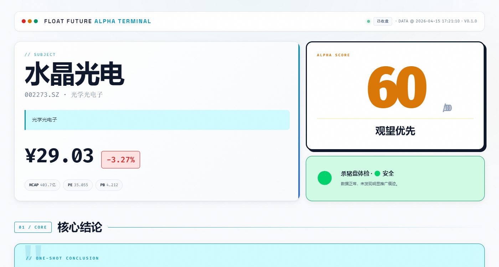
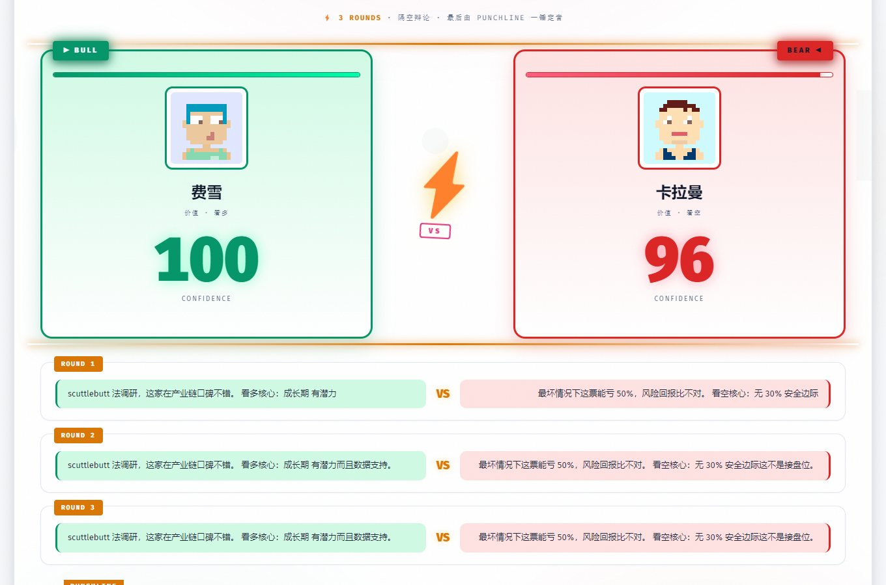
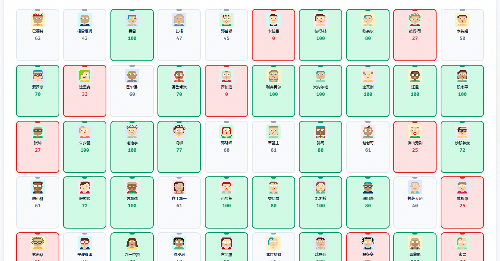
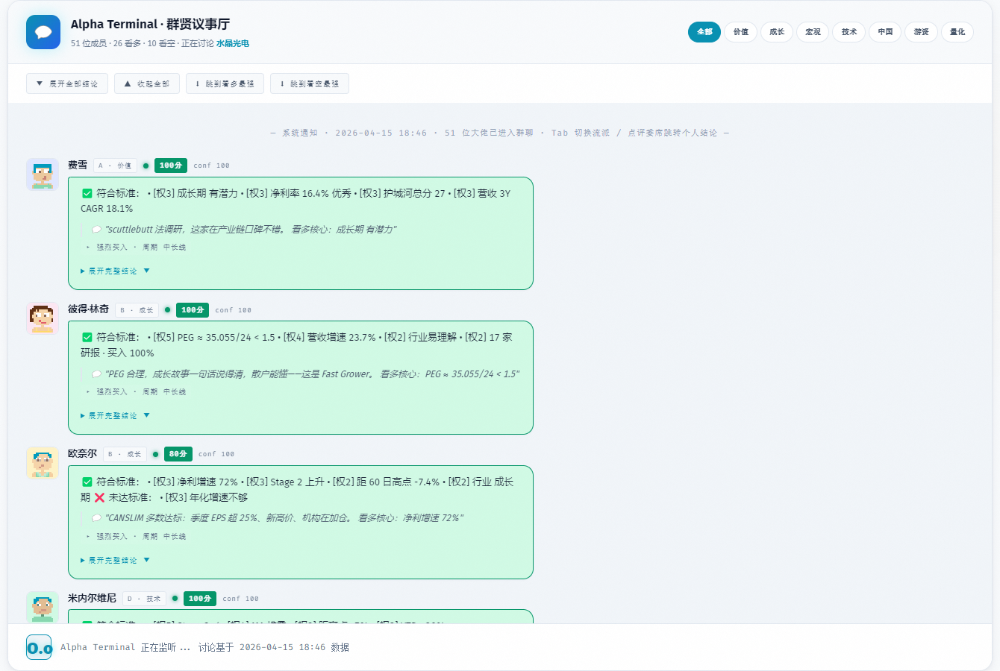
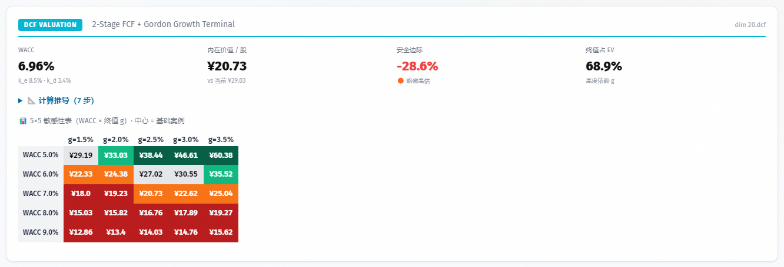
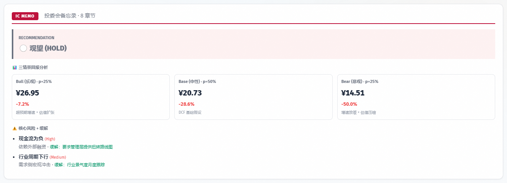
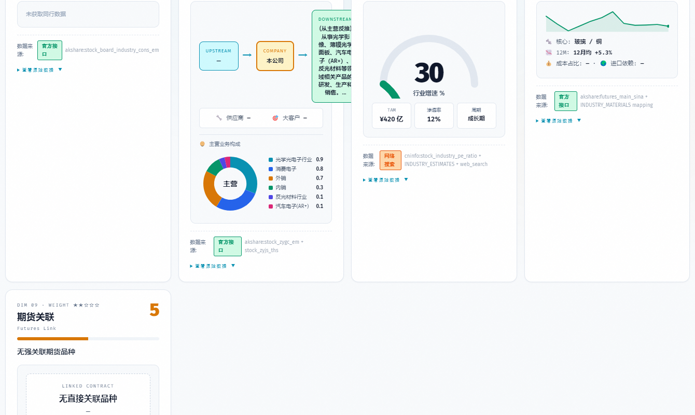
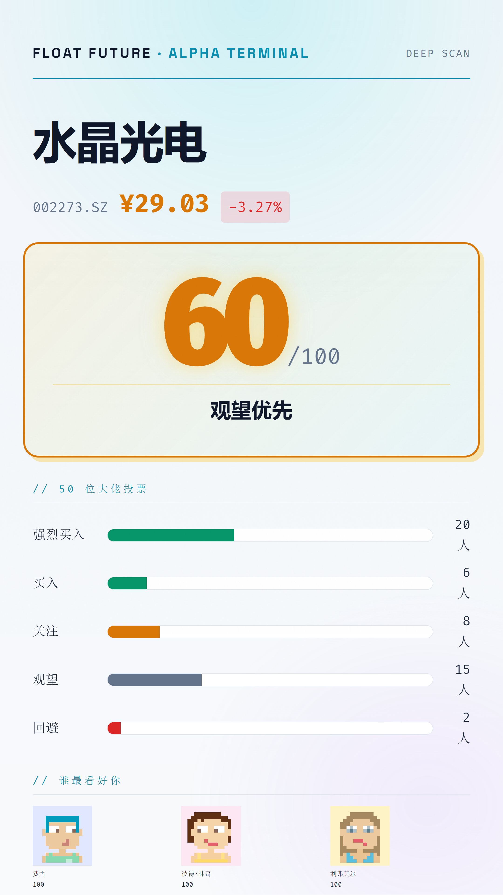

<div align="center">

# 游资 (UZI) Skills

*"66 legendary investors review your stock picks — Buffett and a Chinese day-trader finally sit at the same table."*

[](LICENSE)
[](https://www.rust-lang.org/)
[]()
[](https://claude.com/product/claude-code)
[]()
[]()
[]()
[](crates/uzi-review/src/self_review.rs)

**A-share / HK / US deep-analysis engine — with first-class Chinese-market coverage Western terminals don't touch. 66 investors × 9 schools × 22 dimensions × 22 institutional methods, all free data sources, zero API keys. Single Rust binary `uzi`. v3.9.4: front-end display fixes + polish (kimi-k3).**

**This repository is the Rust re-implementation of the upstream [`wbh604/UZI-Skill`](https://github.com/wbh604/UZI-Skill)** — the whole analysis engine is compiled into one binary (`uzi`) you run from the repository root; the crate workspace lives in `crates/`. Behavior is byte-for-byte aligned with the Python line, locked down by the golden diff tests in [`tools/golden/`](tools/golden/README.md).

[Install](#install) · [Usage](#usage) · [Three Depths](#-three-analysis-depths-new-in-v2103) · [Jury Panel](#-66-investor-jury) · [Serenity 🆕](#-group-i--serenity--ai-chokepoint-hunter) · [Methods](#-22-institutional-methods) · [Self-Review](#-mechanical-self-review-gate-new-in-v29) · [Screenshots](#-what-the-report-looks-like) · [Data Sources](#-data-sources) · [Project Layout](#-project-layout-v3x-architecture) · [FAQ](#-faq) · [Changelog](#-changelog) · [Contributors](CONTRIBUTORS.md)

**English** | [中文](README.md)

</div>

---

## 🌏 Why Western Investors Should Care

If you've ever tried to research a Chinese A-share from outside China, you know the pain:
- Bloomberg covers HK and ADRs, but A-share data is thin and the context is missing.
- Reuters / FT give you macro headlines, not per-company fundamentals.
- Anthropic's [financial-services-plugins](https://github.com/anthropics/financial-services-plugins) ships great institutional models (DCF / LBO / Comps) — **US-only**, and gated behind paid FactSet / S&P feeds.
- You end up copy-pasting from Eastmoney through Google Translate, and by the time you've built a DCF in Excel, the name's already moved 8%.

**This plugin fixes the Chinese half of that problem.** It reads A-share / H-share / US markets with the same interface, speaks to 20+ free Chinese data sources (Eastmoney / Tencent / Sina / CNInfo / XueQiu / Yahoo — direct HTTP, no third-party wrapper), and hands Claude enough context to actually reason about a Chinese company — not just translate its ticker.

It's also why this exists: **if legends get Chinese stocks wrong, ordinary investors need every analytical advantage they can get.** Charlie Munger famously loaded up on Alibaba (BABA) through Daily Journal Corp in 2021, then had to cut the position in half in 2022 after a ~70% drawdown. At the 2022 DJCO meeting, [Munger called it "one of the worst mistakes I ever made"](https://www.cnbc.com/2023/02/15/charlie-munger-says-he-regrets-alibaba-investment-one-of-the-worst-mistakes.html) — an estimated nine-figure hit. Even one of the greatest investors of all time underestimated how differently the Chinese regulatory and competitive landscape behaves.

So yes — this plugin helps you understand Chinese names like **Alibaba** (`BABA` / `09988.HK`), **Tencent** (`00700.HK`), **Kweichow Moutai** (`600519.SH`), **CATL** (`300750.SZ`), **BYD** (`002594.SZ`), **Pop Mart** (`09992.HK`), **Pinduoduo** (`PDD`) — the same names that keep showing up in Western portfolios and keep surprising their owners 😉

---

## 🚀 Quick Start (30 seconds)

**Drop one line into any agent — that's the whole install.** Full instructions in [Install](#install).

| Your agent | Paste this |
|---|---|
| **Claude Code** | `/plugin marketplace add heheshang/uzi-skill` then `/plugin install stock-deep-analyzer@uzi-skill` |
| **Codex / OpenAI CLI** | "Install UZI-Skill following https://raw.githubusercontent.com/heheshang/uzi-skill/main/.codex/INSTALL.md, then analyze 600519" |
| **Cursor** | `/add-plugin stock-deep-analyzer` |
| **Gemini CLI** | `gemini extensions install https://github.com/heheshang/uzi-skill` |
| **Hermes** | `hermes skills install heheshang/uzi-skill/skills/deep-analysis` (if Skills Guard false-positives, build from source instead) |
| **OpenClaw** | "Install https://github.com/heheshang/uzi-skill and analyze Tencent (00700.HK)" |
| **CLI only** | `cargo build --release -p uzi-cli` then `./target/release/uzi 贵州茅台 --no-browser` |

The four commands you'll use most (say them to any agent):

```
/stock-deep-analyzer:analyze-stock 贵州茅台    ← full 22-dim × 66-investor analysis (5-8 min)
/stock-deep-analyzer:quick-scan 002217         ← 30-second sanity check
/stock-deep-analyzer:scan-trap 002217          ← pump-and-dump scan
/stock-deep-analyzer:dcf 600519                ← DCF valuation
```

> 💡 **Latest stable: v3.9.4** · full history in [Changelog](#-changelog):
> - **66 investors · 9 schools** (v3.7 added a16z Andreessen / Naval / Jensen Huang / Musk / Zhang Lei / Burry / Chanos + the standalone Group-I Serenity) · 242 quantified rules
> - **Serenity hardening** (v3.8): 8 penalty factors + 3-tier evidence ladder + 8-layer supply-chain scoring
> - **Tier-1 methods** (v3.8): `--method ai-readiness` / `earnings-preview` / `model-update` / `returns` / `rebalance`
> - **Multi-stock & portfolio** (v3.6): `--versus` 2-4 names · `--portfolio` CSV health check · dark mode + collapsible sticky TOC + jargon tooltips
> - **A+H daily watchlist**: filters ST / stale quotes / turnover < ¥200M · 24 day-trader rules + Serenity evidence checks · at most 10 names, never padded · JSON snapshot + HTML + ledger
> - **School lock** (v3.5): `--school A-I` for a single philosophy's verdict, with a SCHOOL LOCK banner in the report
> - **Architecture**: single Rust binary (`crates/` workspace) · two-stage Stage 1 / Stage 2 · golden diff tests against the upstream Python behavior
>
> **Hermes users**: if Hub install trips the upstream Skills Guard, build from source instead (`cargo build --release -p uzi-cli`), or file a GitHub issue.

---


## 💬 No group chat! (No idea why the group kept getting banned with nothing questionable in it…)

To be clear: there is no group, and I'm not starting one.


> Too many requests — please leave a note so I know what's up.

---

---

## What It Does

One sentence: give it a ticker, Claude becomes your analyst — pulls **22 dimensions of data**, runs **22 Wall-Street analysis models**, has **66 investors with distinct methodologies** score the stock, and produces a 600 KB Bloomberg-style HTML report.

```
/stock-deep-analyzer:analyze-stock 600519         # Kweichow Moutai (A-share)
/stock-deep-analyzer:analyze-stock 00700.HK       # Tencent (HK)
/stock-deep-analyzer:analyze-stock BABA           # Alibaba ADR
/stock-deep-analyzer:analyze-stock AAPL           # Apple
```

After 5-8 minutes you get:
- **A self-contained HTML report** — opens in any browser, works offline
- **A portrait share card** (1080×1920) for social media
- **A landscape war-report card** (1920×1080)
- **A one-line summary** for chat / Slack / Telegram

## Why This Exists

The old workflow for one name: Eastmoney for fundamentals → Tonghuashun for the chart → XueQiu for what the big-Vs said → broker research for the sell-side view → Excel for a DCF → and it still went down after you bought it.

That whole loop is just "collect information → look at it from many angles → form a conclusion." Why not let AI do all of it?

Everything on the market was either a GPT wrapper that outputs three empty paragraphs, or an institutional terminal nobody can afford. Anthropic's [financial-services-plugins](https://github.com/anthropics/financial-services-plugins) has excellent methodology (DCF / Comps / LBO) — but it's US-only and every data feed is paid.

So this was built. **All free data sources, zero API keys, works on A-shares out of the box.**

---

## Install

No matter which agent you use, **one line does it**:

### Claude Code

```
/plugin marketplace add heheshang/uzi-skill
/plugin install stock-deep-analyzer@uzi-skill
```

Then say `/stock-deep-analyzer:analyze-stock Tencent` or `/stock-deep-analyzer:analyze-stock 00700.HK`.

> ⚠️ **Always use the `stock-deep-analyzer:` namespace prefix**
>
> After install, all skills/commands live under `stock-deep-analyzer:<name>`. Short names (`/analyze-stock`) don't always resolve in every environment — to be safe, always use the full name:
> - `/stock-deep-analyzer:analyze-stock <ticker>`
> - `/stock-deep-analyzer:quick-scan <ticker>`
> - `/stock-deep-analyzer:scan-trap <ticker>`
> - `/stock-deep-analyzer:dcf <ticker>` / `:ic-memo` / `:investor-panel` / `:trap-detector` / ...
> - all 20 command cards
>
> Cursor / Gemini CLI / Codex behave the same way — use the full prefixed name.

### Codex

Just tell Codex:

> Please follow https://raw.githubusercontent.com/heheshang/uzi-skill/main/.codex/INSTALL.md to install UZI-Skill, then deep-analyze Alibaba (BABA).

### OpenClaw / 龙虾

> Install https://github.com/heheshang/uzi-skill and analyze Tencent (00700.HK) for me.

### Cursor

```
/add-plugin stock-deep-analyzer
```

Then say "analyze BABA".

### Gemini CLI

```bash
gemini extensions install https://github.com/heheshang/uzi-skill
```

### OpenCode

> Follow https://raw.githubusercontent.com/heheshang/uzi-skill/main/.opencode/INSTALL.md and analyze Pop Mart (09992.HK).

### Windsurf / Devin / Any Other Agent

Paste this:

> Clone https://github.com/heheshang/uzi-skill, read `AGENTS.md`, then deep-analyze Alibaba (09988.HK).

### 🦀 CLI Only (single Rust binary)

No Python environment, no dependency install — you build one self-contained binary:

```bash
cargo build --release -p uzi-cli     # produces target/release/uzi
./target/release/uzi 贵州茅台 --no-browser
```

Run `uzi` from the repository root so the 51 persona files under `skills/deep-analysis/personas/` are picked up by default; from another directory, point back with `export UZI_PERSONAS_DIR=<repo>/skills/deep-analysis/personas`.

### 📱 Not at your desk?

Tell any agent:

> Analyze 00700.HK in remote mode — generate a public link so I can view it on my phone.

The agent spins up a Cloudflare Tunnel and gives you a `https://xxx.trycloudflare.com` URL. If `cloudflared` is missing it only prints install options; add `--install-cloudflared` if you want it installed automatically.

---

## Usage

### Full deep analysis (5-8 minutes)

```
/stock-deep-analyzer:analyze-stock 600519          # A-share by ticker
/stock-deep-analyzer:analyze-stock 00700.HK        # HK
/stock-deep-analyzer:analyze-stock BABA            # US ADR
/stock-deep-analyzer:analyze-stock AAPL            # US
```

> **Ticker format tips for English users:**
> - A-share: 6-digit + `.SH` (Shanghai) or `.SZ` (Shenzhen) — e.g. `600519.SH`, `002594.SZ`. Bare 6-digit like `600519` also works.
> - HK: 5-digit + `.HK` — e.g. `00700.HK`, `09988.HK`.
> - US: plain symbol — `AAPL`, `BABA`, `PDD`, `NVDA`.
> - Chinese names also resolve: `贵州茅台`, `腾讯控股`. For English input, prefer ticker codes over company names (name-resolution is tuned for Chinese).

### Single-purpose commands

> All commands require the `/stock-deep-analyzer:` prefix for reliable dispatch across environments.

| Command | What It Does |
|---|---|
| `/stock-deep-analyzer:dcf 600519` | DCF valuation · WACC + 5×5 sensitivity table |
| `/stock-deep-analyzer:comps 002273` | Peer comparison · PE / PB percentile ranking |
| `/stock-deep-analyzer:lbo 600519` | LBO stress test · PE-buyer IRR perspective |
| `/stock-deep-analyzer:initiate BABA` | Initiating-coverage report · JPM / GS format |
| `/stock-deep-analyzer:ic-memo BABA` | Investment-committee memo · 3-scenario returns |
| `/stock-deep-analyzer:earnings AAPL` | Earnings beat/miss analysis |
| `/stock-deep-analyzer:catalysts 300750` | Catalyst calendar · next 60 days |
| `/stock-deep-analyzer:thesis 600519` | Investment-thesis tracker · 5 pillars |
| `/stock-deep-analyzer:screen AAPL` | 5 quant screens · value / growth / quality / GARP / short |
| `/stock-deep-analyzer:dd BABA` | Due-diligence checklist · 21 items across 5 workstreams |
| `/stock-deep-analyzer:quick-scan 00700.HK` | 30-second sanity check |
| `/stock-deep-analyzer:panel-only 600519` | Just run the 66-investor jury — no HTML report |
| `/stock-deep-analyzer:scan-trap 600519` | Pump-and-dump / trap detection (8 signals) |
| `/stock-deep-analyzer:segmental-model 300308` | Bottom-up segmental revenue model · 3-scenario × 3-year projection · cross-checks top-down DCF |
| `/stock-deep-analyzer:ai-readiness 002273` | 🆕 v3.8 · AI readiness / chokepoint score · 3 gates → Go/Wait + rating |
| `/stock-deep-analyzer:earnings-preview 002273` | 🆕 v3.8 · pre-earnings preview · consensus + Bull/Base/Bear + implied move |
| `/stock-deep-analyzer:model-update 002273` | 🆕 v3.8 · incremental model update · assumption delta → DCF/thesis impact |
| `/stock-deep-analyzer:returns` | 🆕 v3.8 · portfolio return attribution · by holding / sector + top contributors & drags |
| `/stock-deep-analyzer:rebalance` | 🆕 v3.8 · per-holding rebalance · drift + trade list + A-share stamp duty / commission costs |

### 🦀 CLI advanced usage

```bash
uzi 600519.SH --depth lite --no-browser            # 30-60s quick read
uzi 300394.SZ --school I                           # Serenity chokepoint view only (A-I)
uzi --versus 600519.SH 000858.SZ 002594.SZ         # 2-4 names side by side · ★WIN highlights
uzi --portfolio holdings.csv                       # CSV portfolio · weighted score + health
uzi 600519.SH --output-dir /tmp/out                # SaaS integration · index.html + meta.json
uzi 600519.SH --remote                             # public link · won't touch your system if cloudflared is missing
uzi --screen daily --mode close --snapshot-only --no-browser   # daily list from the quote cross-section only
uzi --preview                                      # offline mock report — validates the template
uzi --browser-check                                # probe the CDP browser fallback dependency
uzi --prewarm                                      # pre-warm cross-stock public caches
uzi --xueqiu-status                                # XueQiu login status
```

### 🧩 One method at a time (`--method <NAME>`)

Run `--stage1` once to build the cache and institutional models (every `--method` depends on it), then pull a single method's result.
**stdout is pure JSON** — pipe it straight into `jq`, or feed it to a downstream service.

```bash
uzi <ticker> --stage1              # prerequisite: collect + model + skeleton score
uzi <ticker> --method dcf          # one method's result → pure JSON on stdout
uzi <ticker> --method ic-memo
uzi --portfolio holdings.csv --method rebalance
uzi --portfolio holdings.csv --method returns
```

| `--method` NAME | Type | Reads |
|---|---|---|
| `dcf` · `comps` · `lbo` · `three-statement` | cached (dim 20 valuation) | `raw_data.json → dimensions.20_*` |
| `initiate` · `earnings` · `catalysts` · `thesis` · `morning-note` · `idea-screen` · `sector-overview` | cached (dim 21 research) | `dimensions.21_*` |
| `ic-memo` · `dd` · `competitive` · `unit-economics` · `value-creation` | cached (dim 22 decision) | `dimensions.22_*` |
| `ai-readiness` · `earnings-preview` · `model-update` | on-demand (Tier-1) | computed live by `uzi-models::tier1` |
| `rebalance` · `returns` | portfolio | used with `--portfolio <csv>` |

**Cached** methods just read pre-computed modeling output; **on-demand** methods compute live. See [`commands/`](commands/) and [`skills/deep-analysis/SKILL.md`](skills/deep-analysis/SKILL.md) for the full NAME list.

### 🔀 Two-stage flow: `--stage1` / `--stage2`

The middle of the pipeline **must be agent-driven** (role-play the 66 investors, audit assumptions), so the normal flow is split in two:

```bash
uzi <ticker> --stage1              # Task 1→3: collect + model + rule-engine skeleton, then stop
# → read the cache → role-play 66 investors → write .cache/<ticker>/agent_analysis.json
uzi <ticker> --stage2              # Task 4→5: merge agent_analysis.json → synthesis → report
```

`uzi <ticker>` (without `--stage*`) runs Task 1→5 in one shot with the rule engine's mechanical verdicts — fine for lite/medium.
`--depth deep` **never** runs in one shot; it must go `--stage1 → write agent_analysis.json → --stage2`.

### 📐 Segmental modeling: `--segmental`

```bash
uzi 300308.SZ --segmental discover   # generate the segmental revenue skeleton (3 scenarios × 3 years)
uzi 300308.SZ --segmental validate   # reconcile bottom-up against the top-down DCF
```

### 🛡 Mechanical self-review: `--stage-review`

```bash
uzi <ticker> --stage-review          # 17 self-review checks: exit 1=critical · 2=warning · 0=pass
```

The same checks run automatically before report generation; if `critical > 0`, the HTML physically cannot ship until fixed.

### A+H Daily Watchlist

`uzi --screen daily` is a whole-market scan, not the same thing as the per-stock `/stock-deep-analyzer:screen <ticker>`. By default it pulls the live A-share and HK cross-section, filters ST, delisting, stale quotes and names whose actual turnover is below ¥200M local currency, then produces a rule-screened watchlist. It enriches industry, structured news, order book and intraday bars by default; it is still not agent role-play, does not guarantee execution, and never emits an execution signal from a high score alone.

```bash
uzi --screen daily --mode noon --markets A,H --schools F,I --top 10 --no-browser
uzi --screen daily --mode close --markets A,H --schools F,I --top 10 --no-browser
uzi --screen daily --mode noon --snapshot-only --no-browser  # quote cross-section only when the network is restricted
```

- `--top 10` is a cap, not a quota; research candidates below 70 are never added just to fill the list.
- `--mode noon/close` never turns a live quote into a historical snapshot. The report records the actual observation time; an afternoon run shows the afternoon timestamp, never rewritten as morning. Historical runs must supply an explicit frozen snapshot and must not mix in live news.
- When the quote endpoint provides no industry, the industry ranking stays missing rather than treating "unclassified" as the top theme; A and H rank industries separately, and breadth is computed on the pre-turnover-filter sample.
- Missing industry, unverifiable news or intraday evidence all degrade the name to "watch". Industry comes from the Eastmoney F10 batch mapping (A-share `EM2016`, HK `BELONG_INDUSTRY`); the order book uses Tencent qt with Eastmoney as backup; intraday bars use Eastmoney with Tencent as backup. It never asserts a name is untradeable from a blanket 9.7% move.
- Time and units are handled separately: the quote time comes from the endpoint; Tencent A-share turnover is converted from 万元 to 元, HK keeps HKD, and Tencent's cumulative intraday turnover becomes per-minute increments. A currency or code mismatch, or bars inconsistent with the quote, blocks the name.
- Release gates: quote ≤120s old, industry snapshot ≤300s, industry coverage ≥95%, trading calendar confirms an open session, two-sided order book and three consecutive minutes of valid trades; company news needs a source link and a publication time within 72h. Bid-ask spread, VWAP and price relationships are checked too, and the turnover threshold is re-applied after the quote refresh. These are conservative data/trading condition thresholds, not backtested profit parameters.
- The HTML details section shows the source and quote time of industry, order book and intraday bars, plus original news links and source anomalies; only when every condition passes does it show "data conditions met, pending trade confirmation" — which is not verified execution or completed qualitative research.
- Public HK quotes can be delayed or lack bid/ask sizes; HTTP success alone never lifts a restriction. A compliant real-time feed is required for a more stable book; the tool does not purchase market data or connect to a brokerage account.
- HK has no A-share limit-up system, T+1 or the day-trader/LHB ecosystem, so Group F uniformly `skip`s; Serenity still evaluates normally.
- It does not use news later than the snapshot, news whose time can't be verified, or same-day LHB. Seats are historical style clues only — not a substitute for order/production evidence, and never a claim that a specific individual participated.
- Output lands in `reports/` (`UZI_REPORTS_ROOT` overrides), containing `picks.json`, `report.meta.json` and `index.html`.
- The ledger appends to `.cache/_daily_screen/signals.jsonl`. Rule scores are not probability-calibrated and are not a win rate; the ledger currently records candidates only — return tracking and out-of-sample validation are not done yet.

The deep tier has an extra role-play gate: `uzi <ticker> --depth deep` only runs Stage 1. The agent must read `_agent_review_context.json` from the stock cache and write `analysis_input_hash` into `agent_analysis.json` before Stage 2; role verdicts from an older snapshot are never reused.

---

## 🎯 Scoring Calibration (v2.11)

User feedback like "Moutai scored 47" and "nothing ever crosses 65" traced back to two formulas being too harsh. v2.11 recalibrated:

| Change | Old (v2.9.1) | New (v2.11) | Effect |
|---|---|---|---|
| **verdict thresholds** | 85/70/55/40 | **80/65/50/35** | Nothing ever reached ≥85 (the "conviction buy" band was empty); lowering by 5 lets quality names enter the "can start nibbling" band |
| **consensus neutral weight** | 0.5 (half weight) | **0.6** | Value + day-trader investors (35 of them) skew conservative; at 0.5 a quality name's consensus sat at 37 — 0.6 better matches "not a trap, but not my favorite" |

Formula (unchanged): `overall = fund_score × 0.6 + consensus × 0.4`

Typical quality name (e.g. Moutai):
- v2.9.1: `fund=62 consensus=45 → overall 55 → watch`
- v2.11: `fund=62 consensus=50 → overall 57 → watch` (but closer to the "can start nibbling" boundary; a rally easily pushes it to 65)

Combined impact ~5-8 points. **Real traps still score < 35 → avoid**, so discrimination actually improved.

The diagnostic field `panel.json::consensus_formula.version = "v2.11 · (bullish + 0.6*neutral) / active"` is auditable.
The Rust port reproduces this calibration byte-for-byte in the pipeline's pure scoring functions, locked by golden diff tests.

---

## 🎚️ Three Analysis Depths (new in v2.10.3)

Let users pick how much thinking they want — quick / standard / deep-dive:

```bash
uzi 600519 --depth lite     # ⚡ Quick read (1-2 min)
uzi 600519                   # 📊 Standard (5-8 min) · default
uzi 600519 --depth deep      # 🔬 Institutional (15-20 min)
```

Or via env var:

```bash
export UZI_DEPTH=lite       # or medium / deep
uzi 600519
```

### Differences

| Aspect | ⚡ **lite** | 📊 **medium** | 🔬 **deep** |
|---|---|---|---|
| **Runtime** | 1-2 min | 5-8 min | 15-20 min |
| **Fetchers** | Core 7 dims | All 22 dims | All 22 + reinforced fallback |
| **Investors** | 10 representatives | 66 full panel | 66 + **Bull-Bear structured debate** |
| **Institutional methods** | DCF only | All 22 | All 22 + **Segmental Build-Up** |
| **ddgs qualitative queries** | **all skipped** (saves tokens) | on-demand · budget 30 | full throttle · budget 60 |
| **fund_holders** | Top 5 with full 5Y stats | Top 20 full + rest as listing | Top 100 full |
| **Self-review gate** | critical blocks | critical blocks · warning ack-able | both block |
| **CDP browser fallback** (v2.13.1) | ❌ disabled | opt-in · `UZI_PLAYWRIGHT_ENABLE=1` · **6 dims** (4_peers/8_materials/15_events/17_sentiment/7_industry/14_moat) | ✅ default · **10 dims** (medium 6 + 3_macro/13_policy/18_trap/19_contests) · first-run y/n installs Chromium |
| **Token cost (Codex)** | minimal | moderate | maximum |
| **Use case** | Quick glance · boss just asked · preview ETF holdings | Daily deep analysis · writing research | Investment committee memo · pre-position deep dive |

### Auto-downgrade

- **First install** / empty `.cache/_global` → auto-switches to lite (saves cold-start time)
- **Network preflight 3+ domains unreachable** → auto lite (prevents hanging)
- Manual `--depth` always overrides auto-detection

### Picking the right depth

| Question | Recommended |
|---|---|
| "Can I buy this stock?" | `medium` (default) |
| "Give me a verdict in 15 minutes" | `lite` |
| "Prepping for investment committee tomorrow" | `deep` (includes Bull-Bear debate + bottom-up segmental) |
| "I typed an ETF code — system asked me to pick a holding" | `lite` (quick verdict on component) |
| "Codex environment / first install" | Don't worry — auto lite |

### Implicit depth per command

| Command | Implicit depth |
|---|---|
| `/stock-deep-analyzer:quick-scan 600519` | lite |
| `/stock-deep-analyzer:panel-only 600519` | lite |
| `/stock-deep-analyzer:analyze-stock 600519` | medium (default) |
| `/stock-deep-analyzer:ic-memo 600519` | deep |
| `/stock-deep-analyzer:initiate 600519` | deep |

---

## 🎭 66 Investor Jury

Not template phrases. Each investor has their own **quantified rule set** (242 rules total), their own **real quoted voice**, and their own **authentic decision profile** (time horizon / position sizing / what-would-change-my-mind). Since v3.7.0 there are **13 new tech/VC legends** plus the standalone **Group I — Serenity**, and v3.9.0 distilled **股海贼王** from ten years of real trade records, covering 9 schools:

| Group | Style | Count | Representatives |
|---|---|---|---|
| A | Classic Value | 6 | Buffett · Graham · Munger · Fisher · Templeton · Klarman |
| B | Growth | 9 | Lynch · Cathie Wood · Thiel · **Andreessen (a16z)** · **Gurley (Benchmark)** · **Naval** · **Gerstner (Altimeter)** · **Chamath** |
| C | Macro / Hedge | 7 | Soros · Dalio · Howard Marks · Druckenmiller · Julian Robertson · **Burry** · **Chanos** |
| D | Technical | 4 | Livermore · Minervini · Darvas · Gann |
| E | China Value | 7 | Duan Yongping (段永平) · Zhang Kun · Zhu Shaoxing · Xie Zhiyu · Feng Liu · Deng Xiaofeng · **Zhang Lei (高瓴)** |
| F | A-Share Day Traders (游资) | 24 | Zhang Mengzhu · Zhao Laoge · Chaogu Yangjia · **股海贼王 🆕** (distilled from 10 years of live trade posts) · Beijing Chaojia … |
| G | Quant | 4 | Simons · Thorp · David Shaw · **Asness (AQR)** |
| H | Tech Leaders 🆕 | 4 | **Jensen Huang (NVIDIA)** · **Musk (Tesla)** · **Sam Altman (OpenAI)** · **Saylor (MSTR)** |
| I | AI Chokepoint Hunter 🆕 | 1 | **Serenity (@aleabitoreddit)** |

**Every verdict cites the specific rule it hit.** And each investor answers three questions in their own voice:

| Investor | Time Horizon | What Would Change My Mind |
|---|---|---|
| Buffett | 10+ years / forever | ROE below 12% for 2 consecutive years · CEO change + strategic pivot |
| Zhao Laoge (赵老哥) | T+2 to T+5 | Leader breaks the limit-up · volume doesn't confirm |
| Simons | Avg holding < 2 days | Signal Sharpe drops below 0.5 · factor decay |
| Lynch | Until the story plays out, typically 3-5 years | PEG > 2 · inventory growing faster than revenue |
| Soros | One reflexivity cycle, weeks to months, flip anytime | Market stops validating my narrative |

Their quotes are sourced from **real public materials** — Berkshire annual letters, Oaktree memos, *Principles*, *Margin of Safety*, Lost Tree Club speeches, XueQiu / Zhihu columns — each citation links to the original source. The 51 persona YAMLs live under [`skills/deep-analysis/personas/`](skills/deep-analysis/personas/) (12 flagship + 39 stubs) and load automatically when `uzi` runs from the repository root.

---

## 🧠 Group I · Serenity · AI Chokepoint Hunter

> **A heavyweight role**: the overseas retail researcher [@aleabitoreddit](https://x.com/aleabitoreddit) who blew up on X in 2026. Her own group, scored on her own — because her approach is extremely concentrated and extremely contrarian, unlike any institutional legend.

### Who she is

- Self-described background: **former AI research scientist · Nature paper author · former RISC-V Foundation member · semiconductor / optical-communications engineer**
- Anime avatar, anonymous, no face, no paid course, no copy-trading; all research **free and public**, 300k+ X followers
- Breakout call: pumped the InP substrate chokepoint **$AXTI ($12 → $70+, peak $115–140)** about a year early; in 2026 Q1 IntelliEPI's CEO publicly confirmed "the InP shortage is a bottleneck for the entire AI build-out"

> ⚠️ Identity and returns are **self-reported / media-relayed, unaudited**; sources contradict each other. This project only distills her **methodology** as one analytical lens and does not endorse her actual track record.

### What she does in UZI-Skill

Her **AI supply-chain Chokepoint Theory** becomes a quantified judge: **don't buy the AI leaders** (NVIDIA is fully priced), but walk upstream and find the second/third-tier small-cap that "nobody can route around and whose supply is most likely to run dry" before the market prices it.

```
Leaders get bought up → walk up the supply chain → find the least replaceable link → find the tightest-supply small-cap there → position early
```

**Core logic: "chokepoint decides the stance."** Not cheapness, not growth — a single variable: **does this company's product choke someone else in the current AI wave?**

| Verdict | Stance |
|---|---|
| Chokes (irreplaceable + tight supply + unpriced) | 🟢 **bullish / potentially sized up** |
| On the AI chain but not a hard chokepoint | ⚖️ neutral · pending validation |
| Not a chokepoint / riding a theme / not on the AI chain | 🔴 **skip outright** (a distiller or bank with a perfect moat still scores 0) |

Three tests for a chokepoint: ① **hard to replace** (how long to swap supplier/material/process → `14_moat` switching cost) ② **tight supply** (can capacity keep up with AI demand → `7_industry`) ③ **unpriced** (the market still reads it as a cyclical/old-semiconductor/niche-material story → `5_chain` + `15_events`).

### Run the Serenity lens alone

```bash
uzi 300394.SZ --school I       # Serenity's "is it a chokepoint" verdict only
uzi NVDA --school H            # Group H tech leaders only (Huang / Musk / Altman / Saylor)
```

> Six-step method + five alpha dims: [`skills/deep-analysis/references/fin-methods/serenity-bottleneck.md`](skills/deep-analysis/references/fin-methods/serenity-bottleneck.md);
> voice library + scoring rules: [`skills/investor-panel/references/group-i-serenity.md`](skills/investor-panel/references/group-i-serenity.md).

---

## 📐 22 Institutional Methods

Ported from [anthropics/financial-services-plugins](https://github.com/anthropics/financial-services-plugins), adapted with A-share parameters (rf=2.5% / ERP=6% / tax 25% / terminal g=2.5%). The first 17 plus 5 more added in v3.8.0 (`ai-readiness` `earnings-preview` `model-update` `returns` `rebalance`):

**Valuation & modeling**
- DCF (WACC build-up + two-stage FCF + Gordon Growth terminal + 5×5 sensitivity heatmap)
- Comps (PE / PB / EV-EBITDA percentiles + implied target price)
- 3-Statement forecast (5-year IS / BS / CF linkage)
- Quick LBO (PE-buyer IRR cross-check)
- Merger accretion / dilution

**Research workflow**
- Initiating coverage (JPM/GS/MS format · rating + target + thesis + risks)
- Earnings beat/miss analysis
- Catalyst calendar (real event extraction + forward scheduling + impact tiers)
- Thesis tracker (5-pillar health)
- Morning note · quant screens · sector overview

**Deep decision**
- IC memo (8 sections · Bull/Base/Bear scenarios)
- Porter 5 Forces + BCG matrix
- DD checklist (5 workstreams, 21 items, auto status)
- Unit economics · value-creation plan · portfolio rebalance

Pull a single method's result with `uzi <ticker> --method <NAME>` (pure JSON on stdout).

---

## 📸 What The Report Looks Like

> All screenshots from a real analysis of Crystal Optech (002273.SZ).

### Score dashboard


### The Great Divide — Bull vs Bear
Fisher 100 vs Klarman 96, three rounds, every round citing numbers.



### 66 Jury Seats
One lamp per investor — green bullish, red bearish, grey neutral.



### Chat-room mode
Investors speak in their own voice, quoting the exact rule they hit.



### DCF Sensitivity Heatmap
WACC 6.96% · intrinsic value ¥20.73 · margin of safety -28.6%, from deep green (cheap) to deep red (rich).



### IC Memo — 3 Scenarios
Bull ¥26.95 / Base ¥20.73 / Bear ¥14.51, each with probability and assumptions.



### 22-Dimension Deep Cards
Each dimension has its own visual — candlesticks / PE band / radar / supply-chain flow / thermometer / donut.



### Social Share Card


Artifacts land in `reports/{ticker}_{YYYYMMDD}/`: `full-report.html` (self-contained, offline), `full-report-standalone.html`, `one-liner.txt`, `avatars/`.

---

## 🔧 Data Sources

All free, zero API keys. **This project has no Python dependency and does not use akshare** — the binary's own HTTP client hits the endpoints directly, switching through an `A → B → C → D` fallback chain. The per-field source list is [`skills/deep-analysis/references/data-sources.md`](skills/deep-analysis/references/data-sources.md).

| Data | Primary | Backup |
|---|---|---|
| Live quotes / PE / market cap | Eastmoney push2 (single + full table) | Tencent qt → Sina hq → built-in industry map |
| Financial history | Eastmoney F10 datacenter | HK Eastmoney F10 / US Yahoo fundamentals-timeseries |
| K-line / technicals | Eastmoney push2his daily | Sina getKLineData → Tencent fqkline (6-way fallback) |
| LHB / northbound / margin | Eastmoney datacenter | Exchange disclosures (SZSE / SSE) |
| Research / filings | Eastmoney research + CNInfo hisAnnouncement | Tonghuashun / Cailianshe / Jin10 |
| HK | Eastmoney HK spot (push2 `m:116`) + Tencent qt HK | Yahoo chart v8 |
| US | Yahoo chart v8 + fundamentals-timeseries | Eastmoney |
| Global peers | Yahoo Equity Screener + Fundamentals Timeseries | Local-industry peers + 24h cache |
| FX | Yahoo Chart FX | Original currency always preserved |
| Macro / policy / sentiment / traps | DuckDuckGo web search | — |
| **Social hot lists** (v2.12) | **Weibo / Zhihu / Baidu / Douyin / Toutiao / Bilibili official JSON APIs** | 5-min file cache · one platform failing doesn't affect others |

Multi-layer fallback — one source dies and the next takes over. Every data point carries a `source` field; a web-search fallback sets `fallback: true` and the report renders a "[web search]" badge instead of "[official endpoint]".

### Global peer comparison

For a single-stock run, `4_peers` first keeps local-market peers, then discovers global listed candidates by sub-industry and backfills annual financials for the 8 most relevant. The report shows the global peer median, the target's percentile, a revenue/margin scatter and a cross-market detail table; Comps reuses valid global peers too.

China, Hong Kong, US, Japan, Korea, Taiwan, Singapore, India, Canada, Australia, UK and major European exchanges are recognized, plus any other Yahoo-recognizable suffix as a generic global candidate.

Guardrails:

- Annual, quarterly and TTM figures never share one series.
- Revenue/profit stay in original currency with a separate base-currency conversion; originals are never overwritten.
- Market caps in different currencies are never compared directly for size similarity.
- Negative profit and negative ROE are valid data and are not rewritten to zero.
- Fewer than 3 valid peers → show data only, no global percentile conclusion.
- A single peer or FX source failing never aborts the main report; failed codes stay in the result.

Optional config:

```bash
# Disable global peers entirely, keep only local peers
export UZI_DISABLE_GLOBAL_PEERS=1

# Number of peers to backfill, 3-12, default 8
export UZI_GLOBAL_PEER_LIMIT=10
```

### 📱 6-Platform Social Hot Lists (v2.12)

Retail sentiment and trap themes often ignite on Douyin / Xiaohongshu / Weibo before DuckDuckGo can see them. Since v2.12 the `17_sentiment` dimension checks:

- **Weibo hot search** · `weibo.com/ajax/side/hotSearch` · 50 live entries
- **Zhihu hot list** · `zhihu.com/api/v3/feed/topstory/hot-list-web` · 50
- **Baidu hot search** · `top.baidu.com/api/board`
- **Douyin hot topics** · `douyin.com/aweme/v1/web/hot/search/list/`
- **Toutiao hot board** · `toutiao.com/hot-event/hot-board/`
- **Bilibili hot search** · `s.search.bilibili.com/main/hotword`

When the stock name (or a short form, e.g. "贵州茅台" → "贵州"/"茅台") appears in a hot-list title, it counts toward sentiment heat and the exact entry is recorded.

Structure: `17_sentiment.data.hot_trend_mentions` in synthesis:
```json
{
  "stock_name": "贵州茅台",
  "platforms_ok": 6,
  "total_hits": 3,
  "by_platform_count": {"weibo": 2, "zhihu": 1, "...": 0},
  "mentions": { "weibo": [{"rank":3, "title":"茅台 1499 回归", "...": "..."}], "...": [] }
}
```

### 🔑 Optional: Eastmoney MX (妙想) API (v2.3)

In 2026 `push2.eastmoney.com` is often blocked by anti-scraping from mainland networks. Set `MX_APIKEY` and UZI-Skill prefers the official NLP API:

- **Chinese-name correction**: "北部港湾" → resolved as "北部湾港(000582.SZ)"
- **Quote snapshot**: latest price / market cap / PE / PB / industry without going through push2

```bash
export MX_APIKEY=<your key>        # free: https://dl.dfcfs.com/m/itc4
```

Without a key everything falls back to the Tencent / Sina / Eastmoney HTTP chain — zero impact for existing users.

### 🔓 Login-Required Data Sources (optional, v2.7.1)

Some sources added auth in 2026. UZI-Skill defaults to **never popping a login window** (unattended). Enable on demand:

| Source | Dim | How to Enable | Effect |
|---|---|---|---|
| **XueQiu cubes** | `19_contests` real-money portfolio holdings | `export UZI_XQ_LOGIN=1` then `uzi --xueqiu-login` (one-time browser login) | Off: dim 19 shows "⚠️ XueQiu login required, 0 cubes"; on: sees 50+ real-money portfolios holding the stock |

#### XueQiu login steps

```bash
# 1. Enable the env var (once, add to .zshrc if you like)
export UZI_XQ_LOGIN=1

# 2. One-time login (opens a headed browser; press Enter in the terminal when done)
uzi --xueqiu-login
# → log in via password / WeChat QR / SMS
# → cookies persist to ~/.uzi-skill/playwright-xueqiu/

# 3. Later runs reuse the login automatically (cookies usually valid ≥ 30 days)
uzi 贵州茅台 --no-browser
# dim 19 now shows real cube counts + return distribution

# 4. Enable it for a direct analysis run with a flag
uzi 贵州茅台 --enable-xueqiu-login
```

#### Skipping login (default)

Don't want to log in? Do nothing. The XueQiu dim transparently reports `⚠️ login required, 0 cubes`; the other 21 dims work as usual.

#### Status

```bash
uzi --xueqiu-status
# prints: profile dir / whether cookies exist / whether enabled
```

### 🚨 How Data Gaps Are Handled (v2.3)

If a field can't be fetched (network limits / new listing / halted), the pipeline **never stuffs a default**:

1. Writes `_data_gaps.json` listing a suggested recovery action per gap (CDP browser / MX / WebSearch / derivation)
2. The agent works through them per [HARD-GATE-DATAGAPS](skills/deep-analysis/SKILL.md)
3. Genuinely unrecoverable → explicitly acknowledged via `data_gap_acknowledged` in `agent_analysis.json`
4. The HTML shows an orange banner and renders the field as "—" with a strikethrough

So you can always tell "this stock really isn't worth buying" from "we just didn't get the data."

### 🌐 Restricted Networks (v2.4)

UZI-Skill runs both inside and outside mainland China, with different bottlenecks:

**Mainland network — an endpoint occasionally fails?**

This project has **no install step and no runtime dependencies** — one binary, direct HTTP. When a primary endpoint is blocked it switches through the three-tier fallback chain in [`references/data-sources.md`](skills/deep-analysis/references/data-sources.md); no mirrors to configure, nothing to reinstall.

**Codex / overseas agents — Chinese sources are slow?**

Domestic sources (especially `push2.eastmoney.com`) often time out from abroad. **Set `MX_APIKEY`** (free → https://dl.dfcfs.com/m/itc4); it goes through `mkapi2.dfcfs.com`, reachable from both sides, and also does Chinese-name correction.

```bash
export MX_APIKEY=<your key>
uzi 贵州茅台
```

**Neither side reachable**: the agent should keep `_data_gaps.json` / `_resolve_error.json`. If collection finished but modeling/scoring was interrupted, use `uzi <ticker> --from-modeling` to continue from `raw_data.json`; if `dimensions.json` and `panel.json` exist too, you can go straight to Stage 2 — no need to re-fetch anything.

See [AGENTS.md · restricted networks](AGENTS.md) for the A/B/C quick reference.

---

## 📁 Project Layout (v3.x architecture)

> This repository is the **Rust re-implementation** of the upstream Python line: the same 22 dimensions, the same 242 jury rules, the same scoring formulas and report structure — but all business logic compiles into one `uzi` binary with zero runtime dependencies.

```
UZI-Skill/
├── Cargo.toml / Cargo.lock             # Rust workspace
├── SKILL.md                            # root index (skill routing + command cheat-sheet)
├── crates/                             # ← all business code (10 crates)
│   ├── uzi-core/                       # cache / Python-compatible semantics / testkit / pyrandom
│   ├── uzi-data/                       # 22-dim collection + HTTP endpoint registry + news/hot-list/browser
│   ├── uzi-features/                   # 108 normalized features + scenario simulator (friendly)
│   ├── uzi-investors/                  # 66 investors × 242 rules + persona YAML + seat DB
│   ├── uzi-models/                     # institutional models (DCF/Comps/LBO/IC Memo…) + Tier-1
│   ├── uzi-pipeline/                   # collect → score → synthesize trunk
│   ├── uzi-report/                     # HTML assembly (template / SVG / dim cards / panel cards)
│   ├── uzi-review/                     # 17 mechanical self-checks + data integrity + schema validation
│   ├── uzi-screen/                     # A+H daily watchlist
│   └── uzi-cli/                        # the `uzi` binary + argument parsing
├── skills/
│   ├── deep-analysis/                  # ★ main skill (per-stock analysis)
│   │   ├── SKILL.md
│   │   ├── personas/*.yaml             # 51 personas (12 flagship + 39 stubs)
│   │   └── references/                 # data sources / scoring / modeling / report / fin-methods
│   ├── investor-panel/                 # jury skill (incl. quotes-knowledge-base.md)
│   ├── lhb-analyzer/                   # LHB skill
│   └── trap-detector/                  # trap skill
├── commands/*.md                       # 20 command cards (per-method steps)
├── assets/                             # report-template.html · avatars/ · data-contracts.md
│                                       # disclaimer.md · quality-checklist.md
├── tools/golden/                       # golden diff tests against the upstream Python output
├── tools/skills/verify_docs.py         # doc guard (Rust paths / links / CLI flags / no Python)
├── .claude-plugin / .cursor-plugin / .codex / .opencode / gemini-extension.json   # platform manifests
└── LICENSE
```

**How it maps to the upstream Python line:**

| Upstream Python | This project (Rust) |
|---|---|
| CLI entry script | `uzi` binary (`crates/uzi-cli`) |
| collect / score / synthesize pipeline | `crates/uzi-pipeline` |
| 22-dimension data layer | `crates/uzi-data` + `crates/uzi-features` |
| 66 investors × 242 rules jury engine | `crates/uzi-investors` |
| institutional models + Tier-1 | `crates/uzi-models` |
| report assembly (template / SVG / cards) | `crates/uzi-report` |
| mechanical self-review gate (13 → 17 checks) | `crates/uzi-review` (`--stage-review`) |
| whole-market scan script | `crates/uzi-screen` (`--screen daily`) |
| Python dependency manifest / venv | none — everything is statically compiled into one binary |
| pytest regression | `cargo test` + byte-exact diffs in [`tools/golden/`](tools/golden/README.md) |

**Behavior alignment**: `tools/golden/` feeds the same input and compares the Rust and upstream output trees byte-for-byte (key order, exact float equality, array lengths). The one intentional non-determinism is the random flavor line at the start of each investor comment; the Rust port picks deterministically and validates against `persona_pools.json` that the chosen line is one upstream could have produced.

---

## 🧠 Design Philosophy

**Agent-driven analysis; the script is just a tool.**

Two stages, with a mandatory agent step in between and a mandatory self-check at the end (mechanically enforced since v2.9):

```
Stage 1 (uzi)            → data collection + modeling + rule-engine skeleton scores
        ⏸️ Agent step     → read data → role-play 66 investors → write verdicts → audit assumptions
Stage 2 (uzi)            → synthesis + 17 automatic self-checks → report
                           ↑ v2.9 core: a critical failure → refuses to emit HTML
```

```
          user says "/analyze-stock BABA"          (or uzi BABA --stage1)
                       ↓
   ┌──────────────────────────────────────────────┐
   │   Task 1 · Stage 1 — parallel data fetch      │
   │   22 fetchers × dozens of HTTP sources        │
   │   (Eastmoney / Tencent / Sina / cninfo /      │
   │    Yahoo / DuckDuckGo …)                      │
   └──────────────────────────────────────────────┘
                       ↓ raw_data.json
   ┌──────────────────────────────────────────────┐
   │   Task 2 · Rule-engine scoring                │
   │   22 dims → dimensions.json                   │
   │   66 investors × 242 rules → panel.json       │
   └──────────────────────────────────────────────┘
                       ↓ HARD-GATE (agent takes over)
   ┌──────────────────────────────────────────────┐
   │   Task 3 · Agent analysis                     │
   │   reads quotes-knowledge-base.md + personas   │
   │   writes agent_analysis.json                  │
   │     (dim_commentary · panel_insights ·        │
   │      great_divide · narrative_override …)     │
   └──────────────────────────────────────────────┘
                       ↓ Stage 2 merge
   ┌──────────────────────────────────────────────┐
   │   Task 4 · Synthesis · style weighting        │
   │   stock style × 9-school matrix               │
   │   → synthesis.json                            │
   └──────────────────────────────────────────────┘
                       ↓
   ┌──────────────────────────────────────────────┐
   │   🛡 v2.9 · Mechanical self-review gate       │
   │   uzi-review — 17 automatic checks            │
   │   critical > 0 → refuses to emit HTML         │
   │   agent fixes → re-review → pass              │
   └──────────────────────────────────────────────┘
                       ↓ only when passed
   ┌──────────────────────────────────────────────┐
   │   Task 5 · Report assembly                    │
   │   → full-report.html (single file, offline)   │
   │   → share-card.png · war-report.png           │
   └──────────────────────────────────────────────┘
```

**The 66 investors are not a formula** — the agent genuinely reasons from each one's standpoint:

- Buffett on Apple → the agent knows it's Berkshire's top holding → override bullish
- Zhao Laoge on a US stock → the agent knows day-traders don't trade US → skip
- Cathie Wood on baijiu → the agent knows she only looks at disruptive innovation → "not in the platform"
- Graham seeing PE 33 → no elaborate reasoning needed → bearish

Any judgment can override the rule engine's mechanical score, but it must give a reason.

**Three-layer evaluation**: real holdings → industry affinity → quantified rules. Real money beats any formula.

### 🛡 Mechanical Self-Review Gate (new in v2.9)

The old `HARD-GATE-FINAL-CHECK` was a soft requirement — agents could skip it, forget it, or half-do it. BUG#R10 (Yunnan Aluminum classified as "agricultural food processing") only surfaced after the report had already been sent to users. **Soft gates aren't enough — v2.9 enforces mechanically.**

`uzi-review` runs **17 automated checks** covering every historical BUG class:

| severity | catches | behind it |
|---|---|---|
| 🔴 critical | industry collision (industrial metals → agricultural food processing) | BUG#R10 |
| 🔴 critical | missing dims / empty data / placeholders | wave2 timeout, fetcher crash |
| 🔴 critical | HK kline 0 bars / empty HK financials | BUG#R7 / R8 |
| 🔴 critical | panel all-skip / coverage < 60% | data disaster |
| 🔴 critical | agent_analysis missing / unreviewed | agent skipped |
| 🟡 warning | DCF all zero / metal stock materials empty | v2.8.x coverage gap |
| 🟡 warning | fabricated "Apple supply chain" without raw_data evidence | association hallucination |

Report assembly runs the review automatically; `critical > 0` raises and **physically cannot ship**, until the agent fixes it:

```bash
# agent iteration loop
loop:
  uzi <ticker> --stage-review
  read .cache/<ticker>/_review_issues.json
  execute suggested_fix for each critical
  until critical == 0 → HTML generation proceeds
```

Every fixed BUG adds a matching rule, so the same class is **caught automatically next run, with no user feedback needed.**

---

## ❓ FAQ

**Q: How long does it take?**
A: 5-8 minutes per stock; most of it is fetching (22 dims across a dozen HTTP endpoints). Modeling itself is <1 second. `--depth lite` gives a 1-2 minute quick read.

**Q: Do I need Python?**
A: **No.** This is a single Rust binary with no Python runtime dependency, no dependency manifest, no venv, no installer. `cargo build --release -p uzi-cli` produces `target/release/uzi` and you run it.

**Q: Do I need paid data sources?**
A: No. All free (Eastmoney / Tencent / Sina / CNInfo / XueQiu / Yahoo / DuckDuckGo), zero API keys. The optional `MX_APIKEY` (妙想 API) enhances A-share quotes and is free too.

**Q: Does it work for US / HK stocks?**
A: Yes. `/stock-deep-analyzer:analyze-stock AAPL`, `/stock-deep-analyzer:analyze-stock BABA`, `/stock-deep-analyzer:analyze-stock 00700.HK`. On the CLI that's `uzi AAPL` / `uzi 00700.HK`. HK has a multi-layer kline fallback (Eastmoney → Sina → Tencent → Yahoo Chart v8).

**Q: Can I use English company names?**
A: Best: use ticker codes (`BABA` / `00700.HK` / `600519.SH`). Name-resolution works for Chinese names (`贵州茅台` → `600519.SH`); for English names prefer the ticker.

**Q: What if a prompt mentions akshare and it can't fetch the data?**
A: **This project does not use akshare** — the upstream Python version wrapped it, the Rust version talks to the raw HTTP endpoints directly (Eastmoney / Tencent / Sina / cninfo / Yahoo). When an endpoint fails it switches through the three-tier fallback chain; the full chain is in [`skills/deep-analysis/references/data-sources.md`](skills/deep-analysis/references/data-sources.md).

**Q: Does the 66-investor panel quote real investors?**
A: Yes. `quotes-knowledge-base.md` contains real published quotes from 45+ investors (22 Western, 23 Chinese), each with source URLs (Berkshire letters, Oaktree memos, books, interviews). Agents are instructed to mimic each investor's voice **using these real quotes**, not to fabricate a "Buffett-style" line.

**Q: Is this investment advice?**
A: **No.** This is a research tool, not a fortune teller. The 66 opinions are rule-engine simulations, not the real people's views. Don't bet the farm on Claude's Buffett impression.

**Q: How do I know the report I'm about to read is reliable?**
A: Since v2.9, self-review is **mechanically enforced**. 17 automated checks run before HTML generation; if any critical check fails, the report *physically cannot ship*. Check `.cache/<ticker>/_review_issues.json` for warnings, each with a `suggested_fix`. You can also run `uzi <ticker> --stage-review` manually (exit 1=critical / 2=warning / 0=pass). Every new BUG fix adds a matching check — the same class is **auto-caught next run, no user feedback needed**.

**Q: I'm behind the Great Firewall, will data sources work?**
A: Most do. Eastmoney / Tencent / Sina / XueQiu all work from mainland China. Some Western sources aren't used. DuckDuckGo web search occasionally rate-limits — see `docs/NETWORK-TROUBLESHOOTING.md` if the `3_macro` / `13_policy` / `15_events` dims report empty.

**Q: I'm outside China, will Chinese data sources work?**
A: Yes. Eastmoney / Tencent / Sina / XueQiu / CNInfo all serve international IPs. No VPN needed. The 妙想 API (A-share quotes) requires the free `MX_APIKEY` env var.

**Q: Does the plugin auto-notify me about new versions?**
A: Yes, since v2.14.0. Every CLI run or agent session silently checks the latest GitHub release; if a newer tag exists you get a 3-option prompt (yes / skip-this-version / no) with the release summary. "Skip" suppresses the prompt only for that specific tag — once a newer version drops, you're asked again. Disable with `export UZI_NO_UPDATE_CHECK=1` (recommended for CI / Codex), or check once with `uzi --check-update`. Cached 6h to stay under GitHub's unauthenticated rate limit.

**Q: I ran analyses on earlier versions — were those reports correct?**
A: If you analyzed "industrial metals / machine tools / industrial machinery" stocks (like Yunnan Aluminum / 云铝股份 `000807.SZ`) before 2026-04-17, the `7_industry` dim was misclassified as "agricultural food processing" (BUG#R10). Delete `.cache/<ticker>/` and re-run `uzi <ticker>`.

---

## 📋 Changelog

> This project shares the upstream version numbers and aligns with the upstream line release by release. Entries marked *(upstream Python runtime only)* affect the old implementation's runtime/packaging and have no counterpart in the Rust build.

| Version | Date | Highlights |
|---|---|---|
| **v3.9.4** | 2026-08-08 | Front-end display fixes + polish (kimi-k3): null leakage eliminated (policy/capital-flow fields render "—"/"data pending" instead of `None`); mobile chart clipping fixed (sparkline `width:100%` + single-column stacking, scrollable sensitivity tables); governance wording changed to the neutral "no public violation record found"; watchlist card label spacing; tier color bars on dim cards, smooth anchor scrolling, selection color, `:focus-visible` ring, thin scrollbars, viewport fade-in (respects `prefers-reduced-motion`), TOC `scroll-margin`; 3 sub-skills bumped to 3.9.4. |
| **Unreleased** | 2026-08-05 | Global peer comparison + data-integrity hotfix: auto-discover global candidates by sub-industry and backfill Top-8 annual financials (JP/KR/TW/SG/IN/CA/AU/UK/EU suffixes); original vs USD values separated; peer failure isolation + alternates + 24h cache; report gains target highlight, peer median, global percentile, revenue/margin scatter and detail table, wired into Comps and dim scoring. Plus issue #87/#90 quote-scale, self-peer removal and US TTM fixes. 22 dedicated tests. |
| **v3.9.3** | 2026-08-07 | Moutai deep-run driven fixes: `fcf_positive` now uses real FCF (Moutai no longer flagged cash-flow negative); industry-cycle risk no longer appended unconditionally; `4_peers` hardcoded industry fallback when push2 is blocked (baijiu → Wuliangye / Luzhou Laojiao / Yanghe / Fenjiu); renderer fixes (no leaked dicts, no `abs(None)` crash, no "(None)" target); `--depth deep` now forces the agent role-play gate. 45+ regression tests. |
| **v3.9.2** | 2026-07-07 | Flow & data-contract hotfix (issue #82/#83): explicit `ocf` / `ocf_history` / `ocf_to_net_income_ratio` outputs; `industry=None` peer/valuation fallbacks with a stated reason; registry field contracts aligned with legacy output; structural schema errors in `agent_analysis.json` now fall back to the script skeleton; unified `--versus` / `--portfolio` / `--output-dir` / `--remote` post-processing, `cloudflared` never auto-installed without `--install-cloudflared`. 8 regression tests. |
| **v3.9.1** | 2026-06-23 | Collapsible sticky TOC in the HTML report (issue #79 · @QKioi): `◀` expands, one click collapses to a `☰` handle, state persisted to `localStorage`, safe DOM + `aria-expanded`. 7 regression tests. |
| **v3.9.0** | 2026-06-11 | New judge **股海贼王** (65 → 66), the first distilled from real trade records: 3898 screenshots OCR → 8951 reconstructed fills + 5069 posts over 10 years on Taoguba; 6 data-driven rules in Group F. Original records kept local, not committed. 10 regression tests. |
| **v3.8.1** | 2026-06-09 | Skills audit: 6 H/I wiring gaps fixed (avatar SVGs, school-score order, group labels, defaults, style weights, MARKET_SCOPE + voice lines); docs synced ~35 places (52→65 investors / 7→9 schools / 180→242 rules / `--school A-G`→A-I). 10 regression tests. |
| **v3.8.0** | 2026-06-08 | Tier-1 five methods (`ai-readiness` / `earnings-preview` / `model-update` / `returns` / `rebalance`); Serenity hardening (8 penalty factors, 3-tier evidence ladder, 8-layer supply chain); DuPont decomposition + KDJ/OBV/Williams%R badges. 61 regression tests. |
| **v3.7.1** | 2026-06-04 | README Serenity section + `--school H/I` opened up (CLI choices were stuck at A-G while docs claimed H/I). 533 tests. |
| **v3.7.0** | 2026-06-03 | 13 new tech/VC legends join (52 → 65): B +5 (Andreessen / Gurley / Naval / Gerstner / Chamath), C +2 (Burry / Chanos), E +1 (Zhang Lei), G +1 (Asness), H +4 (Huang / Musk / Altman / Saylor). Each ≥4 rules, test-guarded. 18 regression tests. |
| **v3.6.3** | 2026-06-03 | Serenity joins as judge #52 (standalone Group I): `ai_chokepoint_score` derived feature, "chokepoint decides the stance", all rules weight 5. |
| **v3.6.2** | 2026-06-03 | CNInfo pagination long-tail fix (issue #68): direct `/new/hisAnnouncement/query` HTTP with `pageSize=30 + 15s hard timeout`, hours → ≤15s. Hermes installer pip probing (issue #69) *(upstream Python runtime only)*. |
| **v3.6.1** | 2026-05-29 | Hermes Skills Guard false-positive workaround (issue #66) *(upstream packaging)*; source build is the recommended bypass here. |
| **v3.6.0** | 2026-05-29 | Visual/interaction overhaul + `--versus` multi-stock + `--portfolio` CSV: dark mode, sticky TOC with scroll-spy, count-up scores, jargon tooltips, QR code; 2-4 name side-by-side with 12 ★WIN metrics; portfolio weights normalized, ranked, KPI metadata. |
| **v3.5.0** | 2026-05-29 | Single-school lock (`--school A-I`) with SCHOOL LOCK banner; SaaS integration via `--output-dir` (index.html + report.meta.json). 11 regression tests. |
| **v3.4.5** | 2026-05-12 | Group-F LHB reverse lookup (don't skip a day-trader when their seat actually traded) + low-confidence red banner when fund_score<50 and coverage<60%. 10 regression tests. |
| **v3.4.4** | 2026-05-12 | Data-quality banner UX: fund-type blue banner for ETF/LOF, higher-contrast warning colors. 11 tests. |
| **v3.4.3** | 2026-05-12 | Open-end fund classification fix (issue #60) + field-level fallback gate (PR #63, fill-only, never overwrite). |
| **v3.4.2** | 2026-05-11 | Windows + Clash TLS compatibility *(upstream Python stack only)* — the Rust build uses a compiled TLS stack with the system trust store. |
| **v3.4.1** | 2026-05-11 | Finer verdict granularity (50-65 split into three bands, "X school bullish / Y school bearish" suffix, `verdict_detail`). 5 tests. |
| **v3.4.0** | 2026-05-10 | Fund/ETF holdings loop (list Top-10 + ETA + confirm prompt, then per-holding analysis + summary HTML). |
| **v3.3.4** | 2026-05-10 | V8/mini_racer crash escape hatch *(upstream Python runtime only)* — no embedded JS runtime exists in the Rust build. |
| **v3.3.3** | 2026-05-06 | Community PRs #52/#54/#55/#59: LHB date-loop fix, agent_analysis schema docs, radar import, nested f-string syntax fix. 5 tests. |
| **v3.3.2** | 2026-04-28 | Issue #50 (Stage 2 missing import) + #51 (XueQiu cube endpoint moved to `/query/v1/search/cube/stock.json`). 5 tests. |
| **v3.3.1** | 2026-04-28 | Hermes compatibility regression *(upstream packaging)*. |
| **v3.3.0** | 2026-04-23 | Branch consolidation: segmental rendering layer merged into the v3.2 architecture; 22 stale branches cleaned up. |
| **v3.2.0** | 2026-04-23 | Report assembler split -80% into 5 submodules, all v2.x APIs re-exported, zero end-to-end diff. Maps to `uzi-report`'s module split. |
| **v3.1.0** | 2026-04-23 | Scoring core slimmed -65%: pure functions and preflight helpers extracted; cache→report resume in 10s. Maps to `uzi-pipeline`. |
| **v3.0.0** | 2026-04-23 | Pipeline architecture on by default with automatic fallback; score-from-cache 180s → 10.6s; preflight guards for Chinese names / ETF / LOF / convertible bonds. |
| **v2.15.5** | 2026-04-23 | Consensus recalibration: `0.65*score_mean + 0.35*vote_weighted` with polarization stretch (k=1.3). |
| **v2.15.4** | 2026-04-22 | Per-school `school_scores` (consensus / avg score / verdict per school) + SCHOOL SCORES card. |
| **v2.15.3** | 2026-04-21 | Performance hotfix: shared 24h universe cache, 100× faster second run. |
| **v2.15.2** | 2026-04-21 | Issue hotfixes: Gemini CLI manifest version, richer network self-check + `network_profile.json`. |
| **v2.15.1** | 2026-04-20 | Report-quality fixes: fund-card fake "5Y +0.0%" rows; `14_moat` pollution filter. 11 tests. |
| **v2.15.0** | 2026-04-20 | YAML personas in agent role-play: 51 files (12 flagship + 39 stubs), prefix-stable system messages, zh/en switch, HARD-GATE. 14 tests. |
| **v2.14.0** | 2026-04-20 | Automatic GitHub release check with y/s/n prompt, 6h cache, `UZI_NO_UPDATE_CHECK`. 13 tests. |
| **main** | 2026-04-20 | Segmental Revenue Build-Up shipped (module + CLI + command card); `CONTRIBUTORS.md` added. |
| **v2.13.7** | 2026-04-19 | 16 newly registered sources actually wired into fetchers; A-share event density 3-5 → 10-30. |
| **v2.13.6** | 2026-04-19 | 6 curl-verified futures / finance news sources added (SOURCES 64 → 70). 8 tests. |
| **v2.13.5** | 2026-04-19 | NetworkProfile adaptation (9 targets, 3 groups, 5-min cache) + agent-triggered browser fallback HARD-GATE. 15 tests. |
| **v2.13.4** | 2026-04-19 | 10 curl-verified keyless public sources added (SOURCES 54 → 64). 11 tests. |
| **v2.13.3** | 2026-04-19 | Full historical-stance restoration across all 51 judge rule sets. 10 tests. |
| **v2.13.2** | 2026-04-19 | Browser fallback trigger upgrade: data-quality awareness + FORCE flag. 8 tests. |
| **v2.13.1** | 2026-04-18 | Browser fallback covers all 10 dims (medium 6, deep 10). 22 tests. |
| **v2.13.0** | 2026-04-18 | Generic CDP browser fallback tiered by depth profile (off / opt-in / default). |
| **v2.12.1** | 2026-04-18 | 4 report panels fixed against a real run (peers fallback, industry regex, material junk filter, BCG market share). 16 tests. |
| **v2.12.0** | 2026-04-18 | 6-platform social hot-list aggregation into `17_sentiment.hot_trend_mentions`. 17 tests. |
| **v2.11.0** | 2026-04-18 | Scoring calibration: verdict thresholds `85/70/55/40 → 80/65/50/35`; consensus neutral weight `0.5 → 0.6`. |
| **v2.10.7** | 2026-04-18 | Market hardcode fix, alias resume cache match, light/deep decision tree in AGENTS.md. |
| **v2.10.6** | 2026-04-18 | Providers framework actually wired into the kline chain; health CLI. |
| **v2.10.5** | 2026-04-18 | Coverage threshold profile-aware; medium/deep CLI runs emit reports; fund manager null fallback. |
| **v2.10.4** | 2026-04-17 | Lite self-review false-critical fix; missing agent_analysis CLI handling; ETF early-exit fix. |
| **v2.10.3** | 2026-04-18 | Three analysis depths introduced (`--depth`, `UZI_DEPTH`) + direct HTTP providers. |
| **v2.10.0-2** | 2026-04-18 | First-install & runtime optimization: 4-layer network timeout guard, fund-holder two-tier strategy, cold start 10-15min → 2-4min. |
| **v2.9.x** | 2026-04-17 | Mechanical agent self-review gate: 17 automated checks blocking criticals before HTML. |
| **v2.8.x** | 2026-04-17 | BUG#R10 industry-collision fix, 134 SW→CSRC mappings, 22 real overseas quotes with source URLs, English README. |
| **v2.7.x** | 2026-04-17 | HK financials (BUG#R7) + HK kline fallback (BUG#R8) + wave2 flush (BUG#R9); style weighting; XueQiu opt-in. |
| **v2.6.x** | 2026-04-17 | Agent write-back loop, `agent_analysis.json` merge, dim commentary, 22-dim coverage. |
| **v2.5** | 2026-04-16 | Data-source registry (54 entries), HK AASTOCKS support, 3-tier classification. |
| **v2.0–v2.3** | 2026-04-16 | 17 institutional methods, 51-judge / 180-rule panel, two-stage pipeline, MX API, multi-platform. |
| **v1.0** | 2026-04-14 | Initial release: 19 dims + 50 judges + trap detection. |

Full changelog: [RELEASE-NOTES.md](RELEASE-NOTES.md)

---

## ⭐ Star History

Live count: 

<a href="https://star-history.dera.page/#heheshang/uzi-skill&Date">
 <picture>
   <source media="(prefers-color-scheme: dark)" srcset="https://star-history.dera.page/svg?repos=heheshang/uzi-skill&type=Date&theme=dark" />
   <source media="(prefers-color-scheme: light)" srcset="https://star-history.dera.page/svg?repos=heheshang/uzi-skill&type=Date" />
   
 </picture>
</a>

> Note: star-history.dera.page caches server-side for 24h, so the chart may lag during fast-growth days. For the true current count, see the shields.io badge above, or click the chart to open the live star-history.dera.page page (that triggers a backend refresh).

---

## ⚠️ Disclaimer

This tool generates analysis reports using AI models on public data. All scores, recommendations, and simulated commentary are algorithm outputs and do **not** represent any real investor's actual views (even if a quote is real, the scoring around it is simulated). **Not investment advice.** Past performance is not indicative of future results. Charlie Munger still lost money on Alibaba, and he actually read the 10-Q. Invest at your own risk.

---

## Thanks

[Linux.do](https://linux.do/) — "Linux.do is all you need to learn AI." Thanks for the testing community.

---

<div align="center">

MIT License · Made by FloatFu-true · O.o

</div>
